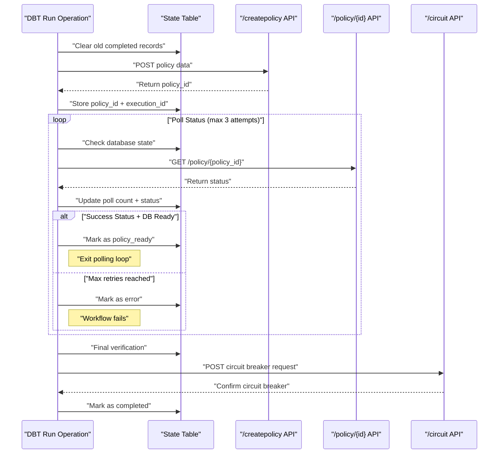

# DBT Snowflake Circuit Breaker - Policy Execution Workflow

This implementation provides a robust **3-step policy execution workflow** with state management and circuit breaker pattern in DBT using Snowflake.

## 🚀 Quick Start

Execute the complete policy workflow with a single command:

```bash
dbt run-operation run_policy_workflow
```

This will execute the full 3-step process:
1. **Create Policy** → Store policy ID in state table
2. **Poll Policy Status** → Validate success (max 3 retries)
3. **Trigger Circuit Breaker** → Only if policy execution succeeded

## 📋 What It Does

The `run_policy_workflow` operation executes a complete policy lifecycle:

### **Step 1: Policy Creation**
- Calls `/createpolicy` API endpoint
- Extracts policy ID from response
- Stores policy ID and execution details in `policy_execution_state` table
- Verifies database storage before proceeding

### **Step 2: Policy Status Polling**
- Polls `/policy/{policy_id}` API endpoint (max 3 attempts)
- Validates both API response AND database state
- Checks for success statuses: `success`, `completed`, `active`, `ready`
- Updates state table with each poll attempt
- Only proceeds to Step 3 if both API and database confirm success

### **Step 3: Circuit Breaker Activation**
- Calls `/circuit` API endpoint
- Triggers circuit breaker for successful policy execution
- Updates final completion status in database
- Marks workflow as successfully completed

## 🔧 Architecture Overview

The implementation uses a state table in Snowflake to track execution status and provides full audit trail of the workflow execution.

### **State Table Structure**
```sql
CREATE TABLE policy_execution_state (
    "execution_id" VARCHAR,
    "policy_id" VARCHAR,
    "poll_count" NUMBER DEFAULT 0,
    "status" VARCHAR DEFAULT 'pending',
    "start_time" TIMESTAMP_NTZ DEFAULT CURRENT_TIMESTAMP(),
    "last_poll_time" TIMESTAMP_NTZ,
    "completed" BOOLEAN DEFAULT FALSE,
    "requires_circuit_breaker" BOOLEAN DEFAULT FALSE,
    "circuit_breaker_initiated" BOOLEAN DEFAULT FALSE,
    "circuit_breaker_completed" BOOLEAN DEFAULT FALSE,
    "error_message" VARCHAR,
    "message" VARCHAR,
    "api_response" VARIANT,
    "policy_data" VARIANT,
    "policy_status_response" VARIANT,
    "circuit_breaker_response" VARIANT
);
```

### **Workflow States**
- `pending` → Initial state
- `policy_created` → Step 1 completed
- `policy_ready` → Step 2 completed (success status confirmed)
- `completed` → Step 3 completed (circuit breaker triggered)
- `error` → Failed at any step

## 🔄 Workflow Sequence



> **Note**: If the diagram above doesn't render properly, you can view it at [Mermaid Live Editor](https://mermaid.live) by copying the code block.

### **Alternative Visual Flow:**

```
┌─────────────────┐    ┌──────────────────┐    ┌─────────────────┐
│   STEP 1        │    │     STEP 2       │    │    STEP 3       │
│ Create Policy   │───▶│  Poll Status     │───▶│ Circuit Breaker │
│                 │    │  (Max 3 retries) │    │                 │
│ ✅ Store in DB  │    │ ✅ Validate DB   │    │ ✅ Complete     │
└─────────────────┘    └──────────────────┘    └─────────────────┘
        │                       │                       │
        ▼                       ▼                       ▼
   policy_created         policy_ready            completed
```

## 📊 Usage Examples

### **1. Execute Complete Workflow**
```bash
# Run the complete 3-step workflow
dbt run-operation run_policy_workflow
```

### **2. Check Execution Results**
```sql
-- View recent executions
SELECT 
    "execution_id",
    "policy_id", 
    "status",
    "poll_count",
    "circuit_breaker_completed",
    "message",
    "start_time"
FROM policy_execution_state 
ORDER BY "start_time" DESC 
LIMIT 10;
```

### **3. Check Current Status**
```sql
-- Check if any executions are in progress
SELECT COUNT(*) as active_executions
FROM policy_execution_state 
WHERE "completed" = FALSE;
```

### **4. Diagnostic Information**
```bash
# Run diagnostic operation to check system state
dbt run-operation diagnose_policy_execution
```

## 🔧 API Integration Points

### **Step 1: Policy Creation**
- **Endpoint**: `POST https://dbttest.free.beeceptor.com/createpolicy`
- **Request**: Policy data (JSON)
- **Response**: `{ "policy_id": "string", "execution_id": "string" }`

### **Step 2: Policy Status Check**
- **Endpoint**: `GET https://dbttest.free.beeceptor.com/policy/{policy_id}`
- **Response**: `{ "status": "success|completed|active|ready|pending|failed" }`

### **Step 3: Circuit Breaker**
- **Endpoint**: `POST https://dbttest.free.beeceptor.com/circuit`
- **Request**: `{ "policy_id": "string", "execution_id": "string", "trigger_reason": "string" }`
- **Response**: Circuit breaker confirmation

## 🚨 Error Handling

The implementation includes comprehensive error handling:

### **API Error Handling**
- **JSON Parsing**: Graceful handling of non-JSON responses
- **HTTP Errors**: Proper status code checking with retries
- **Empty Responses**: Fallback responses for empty API responses
- **Timeout Handling**: 30-second timeout for all API calls

### **Database Error Handling**
- **State Validation**: Verifies each step completion in database
- **Transaction Safety**: Each step is atomic with rollback capability
- **Audit Trail**: Complete history of all operations and errors

### **Step-Specific Error Handling**
- **Step 1 Failure**: Records API call errors and stops execution
- **Step 2 Failure**: Retries up to 3 times with detailed error messages
- **Step 3 Failure**: Marks Steps 1&2 as successful, Step 3 as failed

## 📈 Monitoring and Maintenance

### **Health Checks**
```sql
-- Check for stuck executions (running > 1 hour)
SELECT "execution_id", "status", "start_time", "message"
FROM policy_execution_state
WHERE "completed" = FALSE
AND "start_time" < DATEADD(hour, -1, CURRENT_TIMESTAMP());
```

### **Success Rate Monitoring**
```sql
-- Check success rate in last 24 hours
SELECT 
    COUNT(*) as total_executions,
    SUM(CASE WHEN "status" = 'completed' THEN 1 ELSE 0 END) as successful,
    SUM(CASE WHEN "status" = 'error' THEN 1 ELSE 0 END) as failed,
    ROUND(100.0 * SUM(CASE WHEN "status" = 'completed' THEN 1 ELSE 0 END) / COUNT(*), 2) as success_rate_percent
FROM policy_execution_state
WHERE "start_time" >= DATEADD(hour, -24, CURRENT_TIMESTAMP());
```

### **Automatic Cleanup**
The system automatically cleans up completed records older than 1 hour to prevent table bloat.

## 🔒 Prerequisites

### **Snowflake Setup**
```sql
-- Required: External access integration for API calls
CREATE OR REPLACE EXTERNAL ACCESS INTEGRATION API_EXTERNAL_ACCESS
ALLOWED_NETWORK_RULES = ('allow_all_rule')
ENABLED = TRUE;

-- Grant necessary permissions
GRANT CREATE TABLE ON SCHEMA <your_schema> TO ROLE <your_role>;
GRANT CREATE PROCEDURE ON SCHEMA <your_schema> TO ROLE <your_role>;
GRANT USAGE ON INTEGRATION API_EXTERNAL_ACCESS TO ROLE <your_role>;
```

### **DBT Configuration**
```yaml
# dbt_project.yml
name: 'test_sf'
version: '1.0.0'
profile: 'test_sf'

models:
  test_sf:
    example:
      +materialized: view
```

## 🎯 Key Features

- ✅ **Complete 3-Step Workflow**: Policy creation → Status polling → Circuit breaker
- ✅ **State Management**: Full audit trail in Snowflake table
- ✅ **Error Resilience**: Graceful handling of API failures and non-JSON responses
- ✅ **Retry Logic**: Up to 3 attempts for policy status polling
- ✅ **Database Validation**: Dual validation of API response and database state
- ✅ **Auto Cleanup**: Automatic cleanup of old completed records
- ✅ **Debug Information**: Comprehensive logging and debug output

## 🚀 Advanced Usage

### **Custom Policy Data**
The workflow uses sample policy data by default. To customize, modify the `policy_data` in `run_policy_workflow` macro:

```sql

```

### **Integration with CI/CD**
```bash
# In your CI/CD pipeline
dbt run-operation run_policy_workflow
if [ $? -eq 0 ]; then
    echo "Policy workflow completed successfully"
else
    echo "Policy workflow failed"
    exit 1
fi
```

## 📝 Best Practices

1. **State Management**
   - Monitor the state table regularly
   - Don't manually delete in-progress records
   - Use diagnostic operations for troubleshooting

2. **Error Handling**
   - Check logs for detailed error information
   - Investigate failed executions promptly
   - Monitor success rates over time

3. **Performance**
   - The system auto-cleans old records
   - Monitor table size if high volume
   - Consider archiving old successful executions

## 🔍 Troubleshooting

### **Common Issues**

1. **"API_RESPONSE invalid identifier"**
   - Fixed: Now uses quoted column names for Snowflake case sensitivity

2. **"JSON parsing error"**
   - Fixed: Graceful handling of non-JSON responses with fallback data

3. **"STEP X FAILED"**
   - Check the `error_message` column in `policy_execution_state`
   - Review API endpoints and network connectivity
   - Verify external access integration permissions

### **Debug Commands**
```bash
# Check system status
dbt run-operation diagnose_policy_execution

# View recent executions
dbt run-operation get_policy_execution_state
```

## 🎉 Success Confirmation

A successful execution will show:
- ✅ Step 1: Policy created and stored in state table
- ✅ Step 2: Policy status confirmed as success/ready
- ✅ Step 3: Circuit breaker triggered successfully
- ✅ Final status: `completed` with `circuit_breaker_completed = TRUE`
