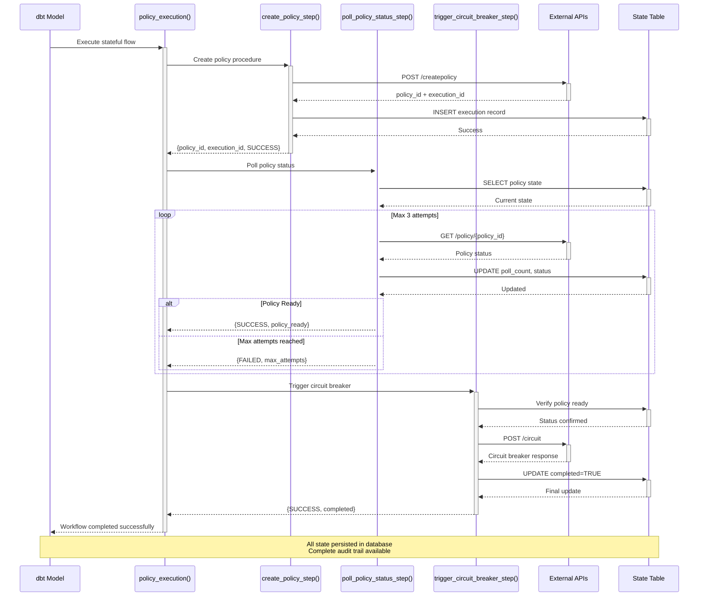
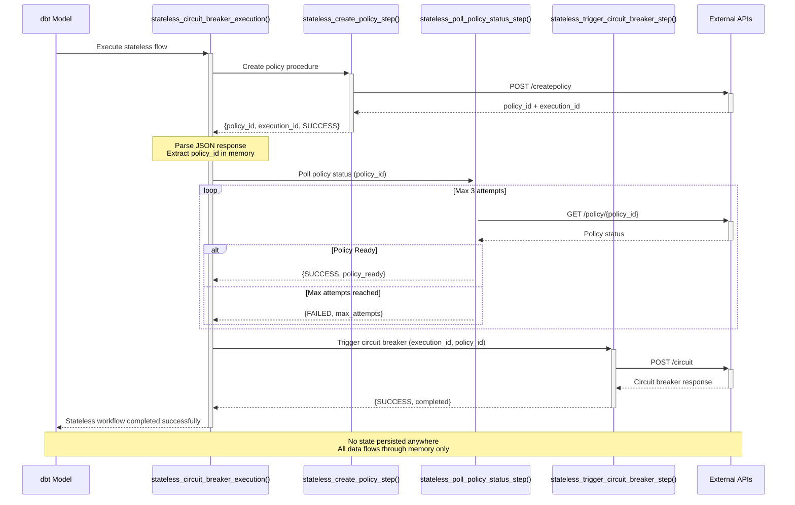

# DBT Snowflake Circuit Breaker - Production Ready

This dbt project provides **two production-ready flows** for circuit breaker operations in Snowflake:

1. **Stateful Flow**: Complete policy execution workflow with persistent state tracking
2. **Stateless Flow**: Direct circuit breaker operations without any state persistence

## 🚀 Quick Start

### Stateful Flow - Complete Audit Trail
Execute the complete policy workflow with full state tracking:

```bash
dbt run --models stateful_policy_execution
```

This single command executes all **3 steps** with persistent state:
1. **Create Policy** → API call to create policy and store in state table
2. **Poll Status** → Poll policy status (max 3 attempts) with state updates
3. **Trigger Circuit Breaker** → Final circuit breaker API call with completion tracking

### Stateless Flow - Pure Execution
Execute immediate circuit breaker operations without state persistence:

```bash
dbt run --models stateless_circuit_breaker
```

This executes the same **3 steps** but without any database state:
1. **Create Policy** → API call to create policy (results in memory only)
2. **Poll Status** → Poll policy status (max 3 attempts) with in-memory tracking
3. **Trigger Circuit Breaker** → Final circuit breaker API call with immediate results

## 📋 Project Structure

### Models
- `stateful_policy_execution.sql` - View of policy execution state with complete audit trail
- `stateless_circuit_breaker.sql` - Direct circuit breaker execution results (no state persistence)

### Macros
- `policy_execution.sql` - Core stateful workflow with state table management
- `run_policy_workflow.sql` - Workflow runner for stateful flow
- `stateless_circuit_breaker_execution.sql` - Stateless workflow implementation
- `get_policy_execution_state.sql` - State querying utility
- `run_query.sql` - Query execution utility
- `drop_policy_execution_objects.sql` - Cleanup utility

## 🔧 Architecture

### Stateful Flow Architecture
Uses a persistent state table to track every step of execution:

```sql
CREATE TABLE policy_execution_state (
    "execution_id" VARCHAR,        -- Unique execution identifier
    "policy_id" VARCHAR,           -- Policy ID from API response
    "poll_count" NUMBER DEFAULT 0, -- Number of polling attempts
    "status" VARCHAR DEFAULT 'pending', -- Current execution status
    "start_time" TIMESTAMP_NTZ DEFAULT CURRENT_TIMESTAMP(),
    "last_poll_time" TIMESTAMP_NTZ,
    "completed" BOOLEAN DEFAULT FALSE,
    "requires_circuit_breaker" BOOLEAN DEFAULT FALSE,
    "circuit_breaker_initiated" BOOLEAN DEFAULT FALSE,
    "circuit_breaker_completed" BOOLEAN DEFAULT FALSE,
    "error_message" VARCHAR,
    "message" VARCHAR,
    "api_response" VARIANT,        -- Full API responses stored
    "policy_data" VARIANT,         -- Original policy data
    "policy_status_response" VARIANT,
    "circuit_breaker_response" VARIANT
);
```

**Key Features:**
- Complete audit trail of all operations
- Persistent state for monitoring and recovery
- Automatic cleanup of old completed records
- Detailed error tracking and messaging

### Stateless Flow Architecture
**No persistent state** - all operations happen in memory within stored procedures:

```sql
-- NO state table used
-- All results returned directly from stored procedure calls
-- Each step passes data to the next step via return values
```

**Key Features:**
- Zero database footprint for state
- Immediate execution with direct results
- No cleanup required
- Perfect for high-frequency operations

## 🔄 Sequence Diagrams

### Stateful Flow Sequence
This diagram shows the complete stateful workflow with database state persistence:



### Stateless Flow Sequence  
This diagram shows the stateless workflow without any database state persistence:



## 🔄 Workflow States

### Stateful Flow States
- `pending` → Initial state when execution starts
- `policy_created` → Step 1 completed (policy created successfully)
- `policy_ready` → Step 2 completed (policy status confirmed ready)
- `completed` → Step 3 completed (circuit breaker triggered successfully)
- `error` → Failed at any step (with detailed error message)

### Stateless Flow Results
- `Stateless workflow completed successfully - no state persisted` → All 3 steps completed
- `Stateless Step X failed` → Failed at specific step (1, 2, or 3)

## 📊 Monitoring

### Stateful Flow Monitoring
```sql
-- Check current executions
SELECT * FROM policy_execution_state 
ORDER BY start_time DESC;

-- Check success rate in last 24 hours
SELECT 
    COUNT(*) as total_executions,
    SUM(CASE WHEN status = 'completed' THEN 1 ELSE 0 END) as successful,
    SUM(CASE WHEN status = 'error' THEN 1 ELSE 0 END) as failed,
    ROUND(100.0 * SUM(CASE WHEN status = 'completed' THEN 1 ELSE 0 END) / COUNT(*), 2) as success_rate_percent
FROM policy_execution_state
WHERE start_time >= DATEADD(hour, -24, CURRENT_TIMESTAMP());

-- Check executions in last hour
SELECT 
    execution_id,
    policy_id,
    status,
    poll_count,
    start_time,
    message
FROM policy_execution_state
WHERE start_time >= DATEADD(hour, -1, CURRENT_TIMESTAMP())
ORDER BY start_time DESC;
```

### Stateless Flow Monitoring
```sql
-- Check recent stateless executions (results only)
SELECT * FROM stateless_circuit_breaker;

-- View shows execution results but no historical state
SELECT 
    workflow_status,
    message,
    execution_timestamp
FROM stateless_circuit_breaker;
```

## 🛠 API Endpoints

Both flows use the same API endpoints:

### Policy Management APIs
- `POST https://dbttest.free.beeceptor.com/createpolicy` - Create policy
- `GET https://dbttest.free.beeceptor.com/policy/{policy_id}` - Poll policy status  
- `POST https://dbttest.free.beeceptor.com/circuit` - Trigger circuit breaker

### Sample API Workflow
```bash
# Step 1: Create Policy
curl -X POST https://dbttest.free.beeceptor.com/createpolicy \
  -H "Content-Type: application/json" \
  -d '{"policy_name": "sample_policy", "policy_type": "data_governance"}'

# Step 2: Poll Status (using policy_id from step 1)
curl -X GET https://dbttest.free.beeceptor.com/policy/744df8ed-a494-4b2e-ae19-f96ae7bfff45

# Step 3: Trigger Circuit Breaker
curl -X POST https://dbttest.free.beeceptor.com/circuit \
  -H "Content-Type: application/json" \
  -d '{"policy_id": "744df8ed-a494-4b2e-ae19-f96ae7bfff45", "execution_id": "exec_123"}'
```

## 🔒 Prerequisites

### Snowflake Setup
```sql
-- Required: External access integration for API calls
CREATE OR REPLACE EXTERNAL ACCESS INTEGRATION API_EXTERNAL_ACCESS
ALLOWED_NETWORK_RULES = ('allow_all_rule')
ENABLED = TRUE;

-- Grant necessary permissions
GRANT CREATE TABLE ON SCHEMA <your_schema> TO ROLE <your_role>;
GRANT CREATE PROCEDURE ON SCHEMA <your_schema> TO ROLE <your_role>;
GRANT CREATE FUNCTION ON SCHEMA <your_schema> TO ROLE <your_role>;
```

### Network Access
Ensure your Snowflake account can access:
- `dbttest.free.beeceptor.com` (for both flows)

## 🚫 Error Handling

### Stateful Flow Error Handling
- **Step 1 Failure**: Records API call errors in state table and stops execution
- **Step 2 Failure**: Retries up to 3 times, records each attempt in state table
- **Step 3 Failure**: Marks Steps 1&2 as successful, Step 3 as failed with detailed error

**Example Error Record:**
```sql
SELECT 
    execution_id,
    status,
    error_message,
    poll_count,
    start_time
FROM policy_execution_state
WHERE status = 'error'
ORDER BY start_time DESC;
```

### Stateless Flow Error Handling
- **Operation Failure**: Returns error status directly in workflow result
- **No Persistence**: Errors are not stored, only returned in execution result
- **Immediate Feedback**: Error details available in dbt logs immediately

## 📈 Performance Comparison

| Feature | Stateful Flow | Stateless Flow |
|---------|---------------|----------------|
| **State Persistence** | Full audit trail | None |
| **Database Writes** | ~5-10 per execution | 0 |
| **Cleanup Required** | Yes (automatic) | No |
| **Monitoring** | Complete history | Current result only |
| **Recovery** | Can resume/retry | Must re-execute |
| **Performance** | Moderate (due to state) | High (no state overhead) |
| **Audit Trail** | Complete | Execution logs only |

## 🎯 Use Cases

### When to Use Stateful Flow
- **Production operations** requiring complete audit trail
- **Critical processes** that need monitoring and recovery capabilities
- **Compliance requirements** for detailed execution tracking
- **Multi-step processes** where intermediate state is important
- **Operations that may need manual intervention** or retry

### When to Use Stateless Flow
- **High-frequency operations** where performance is key
- **Simple processes** without audit requirements
- **Testing and development** scenarios
- **Operations with external monitoring** (logs, metrics)
- **Memory-sensitive environments** with limited database resources

## 📊 Example Execution Results

### Stateful Flow Success
```
07:08:05  Executing Step 1: Create Policy
07:08:25  Step 1 completed - execution_id: exec_20250711_070823, policy_id: 744df8ed-a494-4b2e-ae19-f96ae7bfff45
07:08:25  Executing Step 2: Poll Policy Status
07:08:30  Step 2 completed - Policy is ready for circuit breaker
07:08:30  Executing Step 3: Trigger Circuit Breaker
07:08:35  Step 3 completed - All steps successful!
07:08:35  Execution ID: exec_20250711_070823 completed successfully
07:08:35  Workflow result: Workflow completed successfully
```

### Stateless Flow Success
```
07:28:16  Executing Stateless Step 1: Create Policy
07:28:20  Stateless Step 1 completed - execution_id: stateless_exec_20250711_072820, policy_id: 744df8ed-a494-4b2e-ae19-f96ae7bfff45
07:28:20  Executing Stateless Step 2: Poll Policy Status
07:28:24  Stateless Step 2 completed - Policy is ready for circuit breaker
07:28:24  Executing Stateless Step 3: Trigger Circuit Breaker
07:28:28  Stateless Step 3 completed - All steps successful!
07:28:28  Stateless Execution ID: stateless_exec_20250711_072820 completed successfully (no state persisted)
07:28:28  Stateless workflow result: Stateless workflow completed successfully - no state persisted
```

## 🧹 Maintenance

### Stateful Flow Cleanup
```sql
-- Automatic cleanup (runs before each execution)
DELETE FROM policy_execution_state 
WHERE completed = TRUE 
AND start_time < DATEADD(hour, -1, CURRENT_TIMESTAMP());

-- Manual cleanup for older records
DELETE FROM policy_execution_state 
WHERE completed = TRUE 
AND start_time < DATEADD(day, -7, CURRENT_TIMESTAMP());
```

### Stateless Flow Cleanup
```sql
-- No cleanup required - stateless flow doesn't persist any state
-- Only the view result is stored temporarily
```

### Health Checks
```sql
-- Check for stuck stateful executions
SELECT execution_id, status, start_time, message
FROM policy_execution_state
WHERE completed = FALSE
AND start_time < DATEADD(hour, -1, CURRENT_TIMESTAMP());

-- Check recent execution statistics
SELECT 
    DATE_TRUNC('hour', start_time) as hour,
    COUNT(*) as total_executions,
    SUM(CASE WHEN status = 'completed' THEN 1 ELSE 0 END) as successful,
    SUM(CASE WHEN status = 'error' THEN 1 ELSE 0 END) as failed
FROM policy_execution_state
WHERE start_time >= DATEADD(day, -1, CURRENT_TIMESTAMP())
GROUP BY DATE_TRUNC('hour', start_time)
ORDER BY hour DESC;
```

## 🔧 Configuration

### Customizing Policy Data
Both flows can be customized by modifying the policy data in their respective model files:

**Stateful Flow** (`models/stateful_policy_execution.sql`):
```sql

```

**Stateless Flow** (`models/stateless_circuit_breaker.sql`):
```sql

```

## 📞 Support

For questions or issues:
1. **Check execution logs** in dbt output for immediate error details
2. **Review state table** (stateful flow only) for historical execution data
3. **Verify API endpoints** are accessible from your Snowflake account
4. **Confirm permissions** for creating procedures and tables
5. **Test network connectivity** to `dbttest.free.beeceptor.com`

### Common Issues
- **"invalid identifier" errors**: Check column name casing in queries
- **"procedure not found" errors**: Ensure procedures are created in correct schema
- **API timeout errors**: Check network connectivity and API endpoint availability
- **Permission errors**: Verify grants for creating procedures and tables

## 🏆 Best Practices

1. **Use stateful flow for production** critical operations
2. **Use stateless flow for high-frequency** non-critical operations
3. **Monitor execution success rates** regularly
4. **Set up alerts** for failed executions in stateful flow
5. **Test both flows** in development before production deployment
6. **Configure appropriate cleanup schedules** for stateful flow data retention
