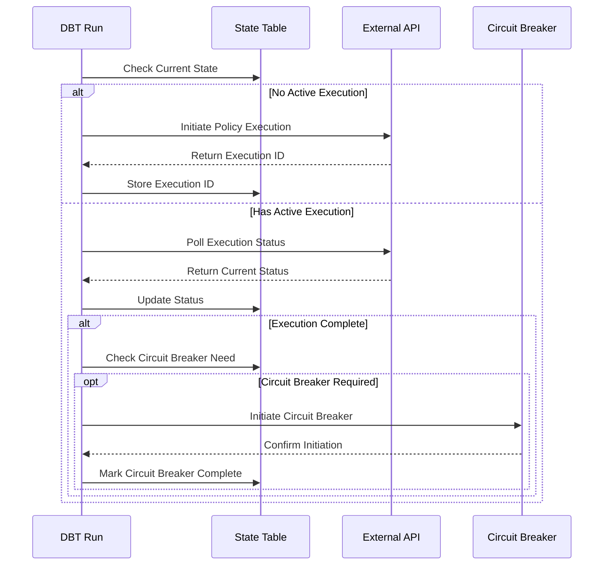

# DBT Policy Execution Implementation

This implementation provides a robust way to handle long-running policy execution operations with state management and circuit breaker pattern in DBT using Snowflake.

## Architecture Overview

The implementation uses a state table in Snowflake to track the execution status and a recursive CTE to handle the polling mechanism. This ensures durability and allows tracking of the execution state across multiple runs.

### Components

1. **State Table**: `policy_execution_state`
   - Tracks execution status
   - Maintains polling history
   - Stores circuit breaker state

2. **Main Model**: `policy_execution_model`
   - Implements the execution logic
   - Handles polling mechanism
   - Manages circuit breaker decisions

3. **Results View**: `policy_execution_results`
   - Provides easy access to execution results
   - Shows current state and history

## Sequence Diagram



## Implementation Steps

1. **Setup State Table**
   ```sql
   CREATE TABLE policy_execution_state (
       execution_id VARCHAR,
       poll_count NUMBER,
       status VARCHAR,
       start_time TIMESTAMP_NTZ,
       last_poll_time TIMESTAMP_NTZ,
       completed BOOLEAN,
       requires_circuit_breaker BOOLEAN,
       circuit_breaker_initiated BOOLEAN,
       error_message VARCHAR,
       message VARCHAR
   );
   ```

2. **Configure DBT Project**
   ```yaml
   # dbt_project.yml
   models:
     your_project:
       example:
         +materialized: table
         +tags:
           - policy_execution
   ```

3. **Create Required Files**
   ```
   models/
   ├── example/
   │   ├── policy_execution_model.sql
   │   └── policy_execution_results.sql
   macros/
   ├── policy_execution.sql
   └── get_policy_execution_state.sql
   ```

## Configuration Requirements

1. **Snowflake Setup**
   ```sql
   -- Required Permissions
   GRANT CREATE TABLE ON SCHEMA <your_schema> TO ROLE <your_role>;
   GRANT CREATE VIEW ON SCHEMA <your_schema> TO ROLE <your_role>;
   ```

2. **Environment Variables**
   ```shell
   # Required for API Integration
   export POLICY_API_ENDPOINT="https://your-api-endpoint"
   export POLICY_API_KEY="your-api-key"
   ```

## Usage

1. **Run the Model**
   ```shell
   dbt run --select policy_execution_model
   ```

2. **Check Results**
   ```shell
   dbt run --select policy_execution_results
   ```

3. **Monitor State**
   ```sql
   SELECT * FROM policy_execution_state
   ORDER BY start_time DESC;
   ```

## Integration Points

1. **Policy Execution API**
   - Endpoint: `POST /api/policy/execute`
   - Response: `{ "execution_id": "string" }`

2. **Status Check API**
   - Endpoint: `GET /api/policy/status/{execution_id}`
   - Response: `{ "status": "string", "completed": boolean }`

3. **Circuit Breaker API**
   - Endpoint: `POST /api/circuit-breaker/initiate`
   - Payload: `{ "execution_id": "string" }`

## Error Handling

The implementation includes comprehensive error handling:

1. **API Failures**
   - Retries on transient failures
   - Records error messages in state table
   - Maintains last known good state

2. **Circuit Breaker Failures**
   - Records failure reason
   - Allows manual intervention
   - Maintains audit trail

3. **State Management**
   - Prevents duplicate executions
   - Handles incomplete states
   - Provides cleanup mechanisms

## Monitoring and Maintenance

1. **Health Checks**
   ```sql
   -- Check for stuck executions
   SELECT *
   FROM policy_execution_state
   WHERE completed = FALSE
   AND start_time < DATEADD(hour, -1, CURRENT_TIMESTAMP());
   ```

2. **Cleanup Old Data**
   ```sql
   -- Remove completed executions older than 7 days
   DELETE FROM policy_execution_state
   WHERE completed = TRUE
   AND start_time < DATEADD(day, -7, CURRENT_TIMESTAMP());
   ```

## Best Practices

1. **State Management**
   - Always use the state table for tracking
   - Don't delete in-progress records
   - Maintain audit trail

2. **Error Handling**
   - Log all API interactions
   - Include error context
   - Enable easy debugging

3. **Circuit Breaker**
   - Define clear trigger conditions
   - Log all decisions
   - Allow manual override

## Limitations

1. **Polling Interval**
   - Fixed at recursive CTE steps
   - No dynamic adjustment
   - Maximum 10 attempts

2. **Concurrency**
   - Single execution at a time
   - No parallel polling
   - Sequential processing

3. **State Cleanup**
   - Manual cleanup required
   - No automatic archiving
   - Requires maintenance

## Future Improvements

1. **Dynamic Polling**
   - Implement exponential backoff
   - Add configurable intervals
   - Support timeout settings

2. **Enhanced Monitoring**
   - Add execution metrics
   - Implement alerting
   - Create dashboards

3. **Advanced Features**
   - Parallel execution support
   - Automatic archiving
   - Retry mechanisms
